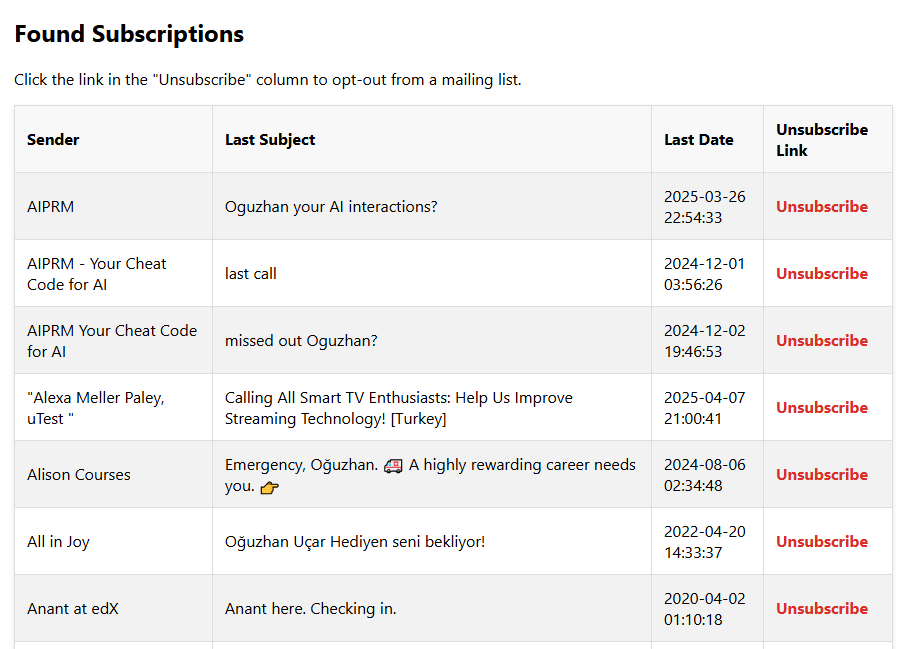

# List-Liberator

[](https://opensource.org/licenses/MIT)

A Python script that scans your Gmail for subscriptions and creates a central HTML dashboard to unsubscribe from them effortlessly. Stop hunting for tiny "unsubscribe" links in every promotional email!

### Preview of the Output

The script generates a clean, single-page HTML file (`subscriptions.html`) that lists all found subscriptions for easy management:



## Features

-   **Secure Authentication:** Uses the official Google API with OAuth2 to securely access your emails in read-only mode. Your credentials are never stored or seen by the script.
-   **Smart Scanning:** Intelligently searches your Gmail (specifically the 'Promotions' category) for emails containing `List-Unsubscribe` headers.
-   **Efficient Processing:** Uses batch API requests to process hundreds of emails quickly without hitting rate limits.
-   **Central Dashboard:** Creates a simple, clean, and local `subscriptions.html` file that lists every unique sender.
-   **One-Click Unsubscribe:** Each entry in the dashboard has a direct "Unsubscribe" link, making it incredibly easy to clean your inbox.
-   **User-Friendly:** No complex setup. Just run the `List-Liberator.py` script, and it handles the rest. It even tells you what to do if you're missing the credentials file.

## How It Works

1.  The script authenticates with your Google Account using the Gmail API.
2.  It performs a search in your inbox for messages with `label:promotions` and the word `unsubscribe`.
3.  It fetches these messages in batches for maximum efficiency.
4.  For each message, it parses the `List-Unsubscribe` header to find the direct unsubscribe URL.
5.  It groups all found subscriptions by the sender, keeping only the most recent email from each one.
6.  Finally, it generates the `subscriptions.html` file with a table of all unique senders and their unsubscribe links.

## Setup and Installation

### Prerequisites

-   Python 3.6+
-   A Google Account (e.g., your @gmail.com account)

### Step 1: Clone the Repository

```bash
git clone https://github.com/Unreliable-Support/List-Liberator.py.git
cd List-Liberator.py
```

### Step 2: Install Dependencies

Install the required Python packages using the `requirements.txt` file.

```bash
pip install -r requirements.txt
```

### Step 3: Get Your Google API Credentials

This is the most important step. The script needs a `credentials.json` file to communicate with the Gmail API.

1.  Go to the [Google Cloud Console](https://console.cloud.google.com/).
2.  Create a **new project** or select an existing one.
3.  From the navigation menu, go to **APIs & Services** > **Enabled APIs & services**.
4.  Click **+ ENABLE APIS AND SERVICES**, search for "**Gmail API**", and **enable** it.
5.  Go back to **APIs & Services** > **Credentials**.
6.  Click **+ CREATE CREDENTIALS** and choose **OAuth client ID**.
7.  For the Application type, select **Desktop app** and give it a name (e.g., "List-Liberator Script").
8.  Click **Create**. A screen will show your client ID and secret. Just click **OK**.
9.  You will now see your new credential in the "OAuth 2.0 Client IDs" list. On the far right, click the **Download JSON** icon (a downward arrow).
10. **Rename the downloaded file to `credentials.json`** and place it in the same directory as the `List-Liberator.py` script.

## Usage

With `credentials.json` in the same folder, simply run the script from your terminal:

```bash
python List-Liberator.py
```

Or, on Windows/macOS, you may be able to just double-click the `List-Liberator.py` file.

-   **First Run:** Your web browser will open, asking you to authorize the application to access your Gmail account (in read-only mode). Grant the permission. A `token.pickle` file will be created to save your authorization for future runs.
-   **Subsequent Runs:** The script will use the `token.pickle` file and run without needing you to authorize again.
-   **Output:** The script will print its progress in the terminal window. When it's done, it will have created the `subscriptions.html` file in the same directory. Open this file in your browser to start unsubscribing!

## License

This project is licensed under the MIT License. See the `LICENSE` file for details.
